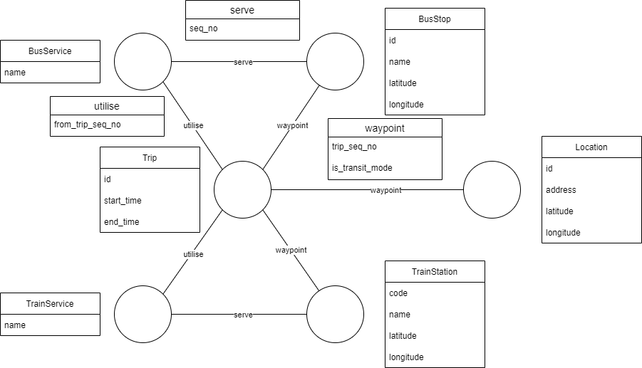

# PlaNET

PlaNET is an application designed for city planners to better understand and improve their transportation systems

## Inspiration

Public transport is the foundation of human mobility in a modern society. Building an effective public transport system is pivotal to promoting a car-lite society. Often, urban areas are subjected to convoluted public transport networks, swaying commuters towards personal vehicles as their preferred mode of transport. Apart from the environmental impacts of shifting away from individual vehicles, it relieves traffic congestion. Public transport systems consist of various intricate mechanisms and factors, which poses a challenge when planning and implementing an effective transport system that brings large volumes of commuters from one location to another. Furthermore, developing effective public transport infrastructure requires a deep understanding of qualitative factors, such as commuter preferences and behaviours. 

This work aims to alleviate challenges city planners face when organising the multitudes of moving components by leveraging graph database and graph analytics to uncover insights on how the public transport network is serving commuters in their journeys. From there, gaps and opportunities to optimise efficiency of public transport services can be identified to improve journeys.

## What it does

PlaNET is a project done using TigerGraph which aims to aid city planners in building effective public transportation systems by better understanding commuter behaviour. It helps to visualise and understand how the public transport network serves commuter journeys and identify gaps and opportunities to optimise efficiency of public transport services to cater to commuter travel preferences. Streamlit is used as a reporting tool to help understand the graph network. 

## How we built it

## Database Schema

## Datasets

In order to analyse the public transport system on its effectiveness, real world datasets need to be collected and loaded into the database. The datasets need to be detailed enough in order to be informative. The following datasets are chosen for the scope of this project:

- Bus Services
- Bus Stops
- Subway/Train Services
- Subway/Train Stations
- Trips, with Origin and Destination Stops/Stations

It is challenging to obtain a stuctured form of these data for a particular city as they are not readily available in a tabular format. Upon research, New York City (NYC) was identified to be an urban location that have the aforementioned datasets.

### Bus Routes and Bus Stops
The bus stop dataset is obtained from Miranda Adams's [NYC-bus-stops-by-route Github page](https://github.com/miranda-adams/NYC-bus-stops-by-route), which provides a dataset with the bus stop names, their IDs as well as their latitudes and longitudes.

The bus routes dataset is obtained from the [Metropolitan Transportation Authority (MTA) website](https://bustime.mta.info/m), where the mobile version of their Bus Time page lists all their bus services. Searching for a bus service lists all the bus stops, their IDs and their sequences. This data is joined with the data from the Github page to get the latitude and longitude for each bus stop.

The bus service dataset is derived from the bus routes dataset, containing the unique bus services along with the directions each bus service operates in.

### Subway Routes and Subway Stations

Subway datasets are retrieved from the New York City Transit Subway data from [MTA's developer website](http://web.mta.info/developers/developer-data-terms.html#data).

### Origin-Destination Data (Proxy for Trips)

For trips, the fare card data by the State of New York for MTA is considered, but it has a few limitations:

- Data is aggregated weekly
- Exit stations (where commuters leave the subway) are not recorded
- Bus data is not included

Thus, another dataset that is more rich should be used. Since there is no trip level dataset for public transport, the [New York City Taxi Trip Duration](https://www.kaggle.com/competitions/nyc-taxi-trip-duration/data) dataset is used. In this dataset, the coordinates (latitude and longitude) for both origin and destination are available. Coupled with the Google Maps Directions API (elaborated in the following section), this dataset for taxi trips can be a proxy to represent public transport trips.

## Data Processing

### Subway Routes and Subway Stations

The subway route dataset is derived from the stop times and stops datasets from MTA's developer website. From the stop times, the route and direction were identified to be in the trip id and stop id respectively, which is sufficient for `TrainService`. Each route and direction are then aggregated and the longest sequence (stop sequence) of station stops is identified. This subway route dataset is crucial in loading the edges `serve` from `TrainService` to `TrainStation` too.

As for the subway stations dataset, the stops dataset is joined with the stop times to filter for stations that are in at least a route. This dataset is then used to load `TrainStation`.

### Trips

The origin and destination coordinates for each taxi trip are extracted. To retrieve the travel mode (to public transport), the [Python client for Google Maps Directions API](https://github.com/googlemaps/google-maps-services-python) is used. The departure times for taxis are used when generating the public transport routes.

The first route for each trip is extracted from the Directions API response. Each route is broken down into multiple directions legs, where details of how to get from one location to another is detailed.

For instance, a route from the Empire State Building to Central Park starts from walking to 34 St - Herald Sq station, then taking the F Line (subway) to 57 Street station, then walking to Central Park. This route consists of 3 legs (walk, subway, walk) and modelled as 4 `waypoint` (Empire State Building, 34 St - Herald Sq station, 57 Street station, Central Park) and `utilise` 1 public transport (subway) service (F Line (subway) from 34 St - Herald Sq station to 57 Street station).

After processing each trip, the transit directions legs are then mapped with `BusService`, `BusStop`, `TrainService` and `TrainStation`.

## Challenges we ran into

## Accomplishments that we're proud of

## What we learned

- TigerGraph
- GSQL
- Python client for Google Maps Directions API
- More about New York City!

## What's next for PlaNET

## Acknowledgements
